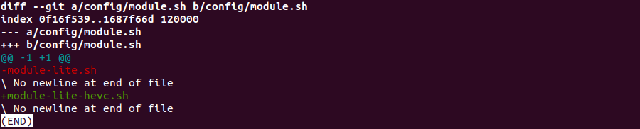

# 1、ijkplayer项目地址
ijk项目已经被fork到我自己的目录下了
https://github.com/helyski/ijkplayer

以下编译方法在如下平台已被证实可行：
VM虚拟机， UBUNTU18.04
# 2、编译环境配置
参照作者readme提供的信息，可知该版本使用NDKR10E是可以的。这里仅这个信息有用。
```
My Build Environment
Common
Mac OS X 10.11.5
Android
NDK r10e
Android Studio 2.1.3
Gradle 2.14.1
iOS
Xcode 7.3 (7D175)
HomeBrew
ruby -e "$(curl -fsSL https://raw.githubusercontent.com/Homebrew/install/master/install
brew install git
```
## 2.0 git和make
如果机器已经安装，则不需要再次安装。如果不确认，可以等执行make错误的时候再安装make。
## 2.1 下载和配置JDK
直接使用命令安装openJDK省去配置烦恼。
```
sudo apt-get install openjdk-8-jre-headless
```
参照https://zhuanlan.zhihu.com/p/639699114的“下载安装openjdk”内容。
## 2.2 下载Android NDK并配置环境变量
下载NDK，android开发者官方能下载，使用readme推荐的版本r10e。   
百度网盘：/我的学习资源/NDK/android-ndk-r10e-linux-x86_64   
官方下载：https://github.com/android/ndk/wiki/Unsupported-Downloads

在/etc/profile中配置ANDROID_NDK环境变量：
```
export ANDROID_NDK=/workspace/_SDK_/android-ndk-r10e
export PATH=$ANDROID_NDK:$PATH
```
## 2.3 下载Android SDK并配置环境变量
**下载SDK，这个比较坑，用wget下载，用命令安装各种组件。**  
参照文章：https://www.jianshu.com/p/86b9c57bf838的“安装SDK”和“配置SDK”部分。
```
#下载命令：
wget http://dl.google.com/android/android-sdk_r24.4.1-linux.tgz
#使用tar -zxvf解压
```

在/etc/profile中配置ANDROID_SDK环境变量：
```
# Setup env for IJKplayer
export ANDROID_SDK=/workspace/_SDK_/android-sdk-linux
export PATH=$ANDROID_SDK/tools:$PATH
export PATH=$ANDROID_SDK/platforms:$PATH
```

如下图是已经配置好的SDK和NDK环境变量：


## 2.4 安装SDK工具
首先使用source /etc/profile使环境变量配置生效。   
参考https://www.jianshu.com/p/86b9c57bf838相关步骤

（1）列出SDK安装包资源
```
android list sdk --all
```

（2）下载包
```
android update sdk -u -a -t 1,2,3,53 //包序号，使用逗号分割
#1,2,3,53是我安装时候的记录，如下图所示
```


# 3、ijkplayer源码下载
使用命令下载到linux编译机器：
```
git clone https://github.com/Bilibili/ijkplayer.git ijkplayer-android
```
**注意：如果先下载到window主机可能会导致编译异常，因为换行符的问题。所以最好直接在编译机器上下载。**
# 4、开始编译
参照readme的编译步骤。
## 4.1 配置config目录下的编译脚本
如下是使用支持hevc的脚本。
```
cd config
rm module.sh
ln -s module-lite-hevc.sh module.sh
cd android/contrib
# cd ios
sh compile-ffmpeg.sh clean
```
## 4.2 Start build Android
上述章节2、3完成之后即可开始编译，需要注意的是，编译过程中会出现第5章节相关的错误，依次进行处理即可。对于ffmpeg编译x86失败的问题，暂时不考究，因为没有x86平台。所以编译./compile-ijk.sh
的时候不能使用all选项，android只需要编译armv7a和arm64即可，具体可以打开脚本到末尾看usage选项配置。

参照如下readme的步骤：
```
git clone https://github.com/Bilibili/ijkplayer.git ijkplayer-android
cd ijkplayer-android
git checkout -B latest k0.8.8

./init-android.sh

cd android/contrib
./compile-ffmpeg.sh clean
./compile-ffmpeg.sh all

cd ..
./compile-ijk.sh all

# Android Studio:
#     Open an existing Android Studio project
#     Select android/ijkplayer/ and import
#
#     define ext block in your root build.gradle
#     ext {
#       compileSdkVersion = 23       // depending on your sdk version
#       buildToolsVersion = "23.0.0" // depending on your build tools version
#
#       targetSdkVersion = 23        // depending on your sdk version
#     }
#
# If you want to enable debugging ijkplayer(native modules) on Android Studio 2.2+: (experimental)
#     sh android/patch-debugging-with-lldb.sh armv7a
#     Install Android Studio 2.2(+)
#     Preference -> Android SDK -> SDK Tools
#     Select (LLDB, NDK, Android SDK Build-tools,Cmake) and install
#     Open an existing Android Studio project
#     Select android/ijkplayer
#     Sync Project with Gradle Files
#     Run -> Edit Configurations -> Debugger -> Symbol Directories
#     Add "ijkplayer-armv7a/.externalNativeBuild/ndkBuild/release/obj/local/armeabi-v7a" to Symbol Directories
#     Run -> Debug 'ijkplayer-example'
#     if you want to reverse patches:
#     sh patch-debugging-with-lldb.sh reverse armv7a
#
# Eclipse: (obselete)
#     File -> New -> Project -> Android Project from Existing Code
#     Select android/ and import all project
#     Import appcompat-v7
#     Import preference-v7
#
# Gradle
#     cd ijkplayer
#     gradle
```

# 5、编译错误处理
## 5.1 Unknown option错误
```
Unknown option “–disable-ffserver”
Unknown option “–disable-vda”
```
删除module中的对应项
## 5.2 libavcodec/eac3_core_bsf.c:39: error: undefined reference to 'ff_ac3_parse_header'
在config/module.sh中添加
```
export COMMON_FF_CFG_FLAGS="$COMMON_FF_CFG_FLAGS --disable-bsf=eac3_core"
```
参见此issues https://github.com/bilibili/ijkplayer/issues/4778
## 5.3 libavcodec/hevc_mvs.c:208:15: error: 'y0000000' undeclared
在config/module.sh中添加
```
export COMMON_FF_CFG_FLAGS="$COMMON_FF_CFG_FLAGS --disable-linux-perf"
```

参见此issues https://github.com/Bilibili/ijkplayer/issues/4093
```
libavcodec/fft_template.c:505:13: note: in definition of macro 'PASS'
 static void name(FFTComplex *z, const FFTSample *wre, unsigned int n)\
             ^
libavcodec/hevc_mvs.c: In function 'derive_spatial_merge_candidates':
libavcodec/hevc_mvs.c:208:15: error: 'y0000000' undeclared (first use in this function)
             ((y ## v) >> s->ps.sps->log2_min_pu_size))
               ^
libavcodec/hevc_mvs.c:204:14: note: in definition of macro 'TAB_MVF'
     tab_mvf[(y) * min_pu_width + x]
              ^
libavcodec/hevc_mvs.c:274:16: note: in expansion of macro 'TAB_MVF_PU'
     (cand && !(TAB_MVF_PU(v).pred_flag == PF_INTRA))
                ^
libavcodec/hevc_mvs.c:368:23: note: in expansion of macro 'AVAILABLE'
     is_available_b0 = AVAILABLE(cand_up_right, B0) &&
                       ^
libavcodec/hevc_mvs.c:208:15: note: each undeclared identifier is reported only once for each function it appears in
             ((y ## v) >> s->ps.sps->log2_min_pu_size))
               ^
libavcodec/hevc_mvs.c:204:14: note: in definition of macro 'TAB_MVF'
     tab_mvf[(y) * min_pu_width + x]
              ^
libavcodec/hevc_mvs.c:274:16: note: in expansion of macro 'TAB_MVF_PU'
     (cand && !(TAB_MVF_PU(v).pred_flag == PF_INTRA))
                ^
libavcodec/hevc_mvs.c:368:23: note: in expansion of macro 'AVAILABLE'
     is_available_b0 = AVAILABLE(cand_up_right, B0) &&
                       ^
libavcodec/hevc_mvs.c:207:15: error: 'x0000000' undeclared (first use in this function)
     TAB_MVF(((x ## v) >> s->ps.sps->log2_min_pu_size),                     \
               ^
libavcodec/hevc_mvs.c:204:34: note: in definition of macro 'TAB_MVF'
     tab_mvf[(y) * min_pu_width + x]
                                  ^
libavcodec/hevc_mvs.c:274:16: note: in expansion of macro 'TAB_MVF_PU'
     (cand && !(TAB_MVF_PU(v).pred_flag == PF_INTRA))
                ^
libavcodec/hevc_mvs.c:368:23: note: in expansion of macro 'AVAILABLE'
     is_available_b0 = AVAILABLE(cand_up_right, B0) &&
                       ^
libavcodec/hevc_mvs.c: In function 'ff_hevc_luma_mv_mvp_mode':
libavcodec/hevc_mvs.c:208:15: error: 'y0000000' undeclared (first use in this function)
             ((y ## v) >> s->ps.sps->log2_min_pu_size))
               ^
libavcodec/hevc_mvs.c:204:14: note: in definition of macro 'TAB_MVF'
     tab_mvf[(y) * min_pu_width + x]
              ^
libavcodec/hevc_mvs.c:274:16: note: in expansion of macro 'TAB_MVF_PU'
     (cand && !(TAB_MVF_PU(v).pred_flag == PF_INTRA))
                ^
libavcodec/hevc_mvs.c:683:24: note: in expansion of macro 'AVAILABLE'
     is_available_b0 =  AVAILABLE(cand_up_right, B0) &&
                        ^
libavcodec/hevc_mvs.c:207:15: error: 'x0000000' undeclared (first use in this function)
     TAB_MVF(((x ## v) >> s->ps.sps->log2_min_pu_size),                     \
               ^
libavcodec/hevc_mvs.c:204:34: note: in definition of macro 'TAB_MVF'
     tab_mvf[(y) * min_pu_width + x]
                                  ^
libavcodec/hevc_mvs.c:274:16: note: in expansion of macro 'TAB_MVF_PU'
     (cand && !(TAB_MVF_PU(v).pred_flag == PF_INTRA))
                ^
libavcodec/hevc_mvs.c:683:24: note: in expansion of macro 'AVAILABLE'
     is_available_b0 =  AVAILABLE(cand_up_right, B0) &&
                        ^
make: *** [libavcodec/hevc_mvs.o] Error 1
```

## 5.4 ffmpeg x86编译失败
目前只需要android的，故不处理。但是后面编ijkplayer的时候不能使用all，否则会报错。

## 5.5 编译需要修改的总结
这个本应该放在第4章节前去说明的，如此便能一次编译通过，但是不符合事物发展的规律。

（1）修改以支持HEVC（上面已有描述）


（2）修改第5章节的issues


# 6、AS导入编译出来的demo工程
（1）使用2022.3.1 Patch 3版本的AS需要修改gradle插件版本相关的配置。

参考版本升级：从2020版本升级到2023版本需要更新的项目配置。(YNote)

（2）修改example目录的build.gradle。

参照https://blog.csdn.net/shulianghan/article/details/132281575。

**如下是更新后可以使用的修改：**

```
apply plugin: 'com.android.application'

android {
    // http://tools.android.com/tech-docs/new-build-system/tips
    //noinspection GroovyAssignabilityCheck
    compileSdkVersion rootProject.ext.compileSdkVersion
    //noinspection GroovyAssignabilityCheck
//    buildToolsVersion rootProject.ext.buildToolsVersion

//    lintOptions {
//        abortOnError false
//    }
    defaultConfig {
        applicationId "tv.danmaku.ijk.media.example"
        minSdkVersion 26
        targetSdkVersion rootProject.ext.targetSdkVersion
        versionCode rootProject.ext.versionCode
        versionName rootProject.ext.versionName
    }
    buildTypes {
        release {
            minifyEnabled false
            proguardFiles getDefaultProguardFile('proguard-android.txt'), 'proguard-rules.pro'
        }
    }
    // !!!!!!!!!!!!!!!!!!!!!!!!!!!!!!
    // 修改点
    flavorDimensions "minSdkVersion"

    productFlavors {
        all32 { minSdkVersion 9 }
        all64 { minSdkVersion 21 }
        // armv5 {}
        // armv7a {}
        // arm64 { minSdkVersion 21 }
        // x86 {}
    }
}
// !!!!!!!!!!!!!!!!!!!!!!!!!!!!!!
// 修改所有的compile 为 implementation
dependencies {
    implementation fileTree(include: ['*.jar'], dir: 'libs')
    implementation 'com.android.support:appcompat-v7:23.0.1'
    implementation 'com.android.support:preference-v7:23.0.1'
    implementation 'com.android.support:support-annotations:23.0.1'

    implementation 'com.squareup:otto:1.3.8'

    implementation project(':ijkplayer-java')
    implementation project(':ijkplayer-exo')

    implementation project(':ijkplayer-armv5')
    implementation project(':ijkplayer-armv7a')
    implementation project(':ijkplayer-x86')

    implementation project(':ijkplayer-armv5')
    implementation project(':ijkplayer-armv7a')
    implementation project(':ijkplayer-arm64')
    implementation project(':ijkplayer-x86')
    implementation project(':ijkplayer-x86_64')

    // compile 'tv.danmaku.ijk.media:ijkplayer-java:0.8.8'
    // compile 'tv.danmaku.ijk.media:ijkplayer-exo:0.8.8'

    // all32Compile 'tv.danmaku.ijk.media:ijkplayer-armv5:0.8.8'
    // all32Compile 'tv.danmaku.ijk.media:ijkplayer-armv7a:0.8.8'
    // all32Compile 'tv.danmaku.ijk.media:ijkplayer-x86:0.8.8'

    // all64Compile 'tv.danmaku.ijk.media:ijkplayer-armv5:0.8.8'
    // all64Compile 'tv.danmaku.ijk.media:ijkplayer-armv7a:0.8.8'
    // all64Compile 'tv.danmaku.ijk.media:ijkplayer-arm64:0.8.8'
    // all64Compile 'tv.danmaku.ijk.media:ijkplayer-x86:0.8.8'
    // all64Compile 'tv.danmaku.ijk.media:ijkplayer-x86_64:0.8.8'

    // armv5Compile project(':player-armv5')
    // armv7aCompile project(':player-armv7a')
    // arm64Compile project(':player-arm64')
    // x86Compile project(':player-x86')
    // x86_64Compile project(':player-x86_64')
}
```


# 7、参考文档
（1）编译错误，主要看前4个issues    
https://github.com/befovy/ijkplayer/issues    
https://github.com/befovy/ijkplayer/issues/16    
https://github.com/Bilibili/ijkplayer/issues/4093    
https://github.com/bilibili/ijkplayer/issues/4778    
https://blog.csdn.net/hhbgk/article/details/99191916        
（2）运行错误    
https://blog.csdn.net/shulianghan/article/details/132281575    
（3）环境配置    
https://zhuanlan.zhihu.com/p/639699114    
https://blog.csdn.net/Ruomiz/article/details/78456187    
https://www.jianshu.com/p/86b9c57bf838      
（4）下载    
https://github.com/android/ndk/wiki/Unsupported-Downloads    


